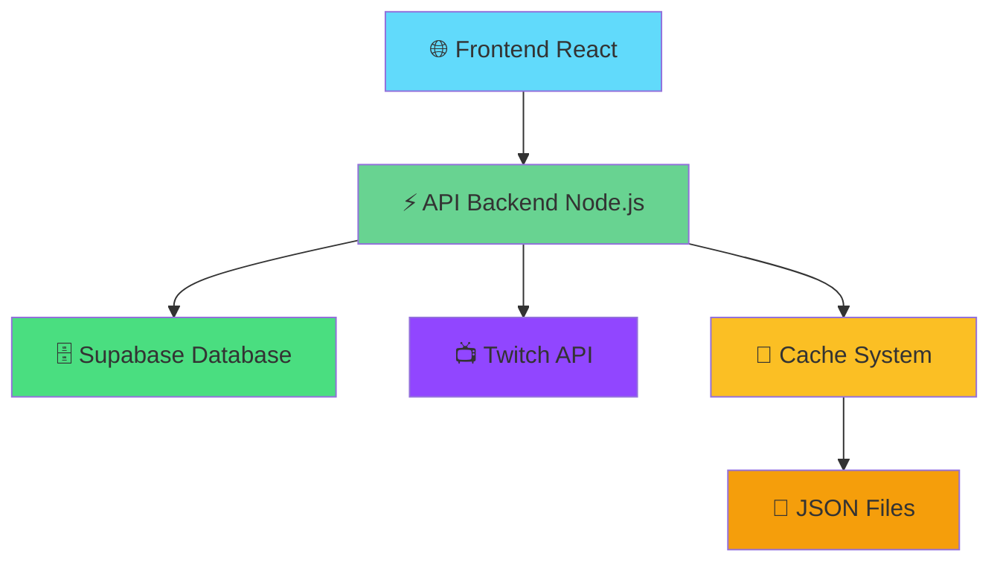

<style src="./style.css"></style>

# 0Viewers

<div class="pt-6 text-xl opacity-80">
Découvrez des streamers talentueux avec 0 viewers
</div>

<div class="pt-12">
  <span @click="$slidev.nav.next" class="explore-btn animate-in">
    Commencer la présentation <carbon:arrow-right class="inline ml-2"/>
  </span>
</div>

<!--
Bienvenue dans la présentation de 0Viewers !
Cette plateforme révolutionne la découverte de nouveaux streamers.
-->

---
layout: center
class: text-center
transition: fade-out
---

# Le problème

<v-clicks>

<div class="text-2xl pt-4 opacity-90">
Des milliers de streamers talentueux<br/>
diffusent sans audience
</div>

<div class="pt-8">
  <div class="text-6xl">😢</div>
</div>

<div class="pt-4 text-lg opacity-70">
Comment les découvrir dans l'océan Twitch ?
</div>

</v-clicks>

<!--
Le problème est réel : avec des millions de streamers sur Twitch,
les nouveaux créateurs se perdent dans la masse.
Même les plus talentueux peuvent streamer des heures sans un seul viewer.
-->

---
layout: center
class: text-center
transition: slide-up
---

# Notre solution

<v-clicks>

<div class="text-2xl pt-4 opacity-90">
Une plateforme dédiée à la découverte<br/>
de nouveaux créateurs
</div>

<div class="pt-8">
  <div class="text-6xl">🚀</div>
</div>

<div class="pt-4 text-lg opacity-70">
Donner sa chance à chaque streamer
</div>

</v-clicks>

<!--
0Viewers se concentre exclusivement sur les streamers avec 0 viewer.
C'est notre niche : être le pont entre les nouveaux créateurs et leur première audience.
-->

---
layout: two-cols
class: text-center
transition: view-transition
---

# Pour les Streamers

<div class="pt-8 space-y-4">
  <div v-click="1" class="text-left card">
    <div class="text-xl">🎯 <strong>Visibilité</strong></div>
    <div class="pl-8 opacity-80">Être découvert par de nouveaux viewers</div>
  </div>
  
  <div v-click="2" class="text-left card">
    <div class="text-xl">💪 <strong>Support</strong></div>
    <div class="pl-8 opacity-80">Rejoindre une communauté bienveillante</div>
  </div>
  
  <div v-click="3" class="text-left card">
    <div class="text-xl">📈 <strong>Croissance</strong></div>
    <div class="pl-8 opacity-80">Développer son audience naturellement</div>
  </div>
</div>

::right::

# Pour les Viewers

<div class="pt-8 space-y-4">
  <div v-click="4" class="text-left card">
    <div class="text-xl">🔍 <strong>Découverte</strong></div>
    <div class="pl-8 opacity-80">Trouver des contenus uniques et authentiques</div>
  </div>
  
  <div v-click="5" class="text-left card">
    <div class="text-xl">💎 <strong>Exclusivité</strong></div>
    <div class="pl-8 opacity-80">Être parmi les premiers à découvrir un talent</div>
  </div>
  
  <div v-click="6" class="text-left card">
    <div class="text-xl">🤝 <strong>Impact</strong></div>
    <div class="pl-8 opacity-80">Avoir un vrai impact sur la carrière d'un créateur</div>
  </div>
</div>

---
layout: center
class: text-center
transition: slide-left
---

# Comment ça marche ?

<div class="grid grid-cols-3 gap-8 pt-12">
  <div v-click="1" class="space-y-4 card">
    <div class="text-4xl">🔄</div>
    <div class="text-lg font-semibold">Scan automatique</div>
    <div class="text-sm opacity-80">L'API Twitch est scannée en continu</div>
  </div>
  
  <div v-click="2" class="space-y-4 card">
    <div class="text-4xl">🎯</div>
    <div class="text-lg font-semibold">Filtrage intelligent</div>
    <div class="text-sm opacity-80">Seuls les streamers à 0 viewer sont affichés</div>
  </div>
  
  <div v-click="3" class="space-y-4 card">
    <div class="text-4xl">🌟</div>
    <div class="text-lg font-semibold">Mise en avant</div>
    <div class="text-sm opacity-80">Interface simple et moderne pour découvrir</div>
  </div>
</div>

---
layout: center
class: text-center
transition: fade-out
---

# Prêt à découvrir ?

<v-clicks>

<div class="pt-8 text-xl opacity-90">
Explorez dès maintenant des streamers talentueux
</div>

<div class="pt-12">
  <a href="http://localhost:5173/" target="_blank" class="explore-btn">
    🚀 Accéder à 0Viewers
  </a>
</div>

<div class="pt-8 text-sm opacity-70">
Cliquez pour ouvrir l'application en local
</div>

</v-clicks>

<!--
Merci pour votre attention !
N'hésitez pas à tester l'application et à donner votre feedback.
Ensemble, donnons sa chance à chaque créateur de contenu !
-->

---
layout: center
class: text-center
---

# Architecture Technique



<!--
L'architecture est simple mais robuste :
- Frontend React moderne avec Vite
- Backend Node.js avec Express
- Base de données Supabase pour l'auth et les données
- Cache intelligent pour optimiser les performances
- Intégration directe avec l'API Twitch
-->

---
layout: two-cols
transition: slide-up
---

# 💻 Stack Technique

## Frontend
```js {1-3|5-7|9-15|all}
// React + Vite + Hooks
import { useState, useEffect } from 'react'
import { fetchZeroViewersStreamers } from './api'

function StreamerList() {
  const [streamers, setStreamers] = useState([])
  const [loading, setLoading] = useState(true)
  
  useEffect(() => {
    fetchZeroViewersStreamers()
      .then(data => {
        setStreamers(data)
        setLoading(false)
      })
  }, [])
  
  return (
    <div className="streamers-grid">
      {streamers.map(streamer => (
        <StreamerCard key={streamer.id} {...streamer} />
      ))}
    </div>
  )
}
```

::right::

## Backend
```js {1-4|6-8|10-14|16-20|all}
// Node.js + Express + Cache
const express = require('express')
const cache = require('./services/cacheService')
const twitchAPI = require('./services/twitchStreams')

app.get('/api/zero-viewers', async (req, res) => {
  try {
    // Vérifier le cache d'abord
    const cached = await cache.get('zero-streamers')
    if (cached && !cache.isExpired(cached)) {
      return res.json(cached.data)
    }
    
    // Appel API Twitch si pas de cache
    const streams = await twitchAPI.getStreams({
      viewer_count: 0,
      first: 20
    })
    
    // Mise en cache pour 1 minute
    await cache.set('zero-streamers', streams, 60)
    res.json(streams)
  } catch (error) {
    res.status(500).json({ 
      error: 'Erreur serveur',
      message: error.message 
    })
  }
})
```

<!--
Le code est clean et maintenable :
- Frontend React moderne avec hooks et gestion d'état
- Backend Express avec middleware et gestion d'erreurs
- Système de cache intelligent pour optimiser les performances
- API REST documentée et versionée
-->